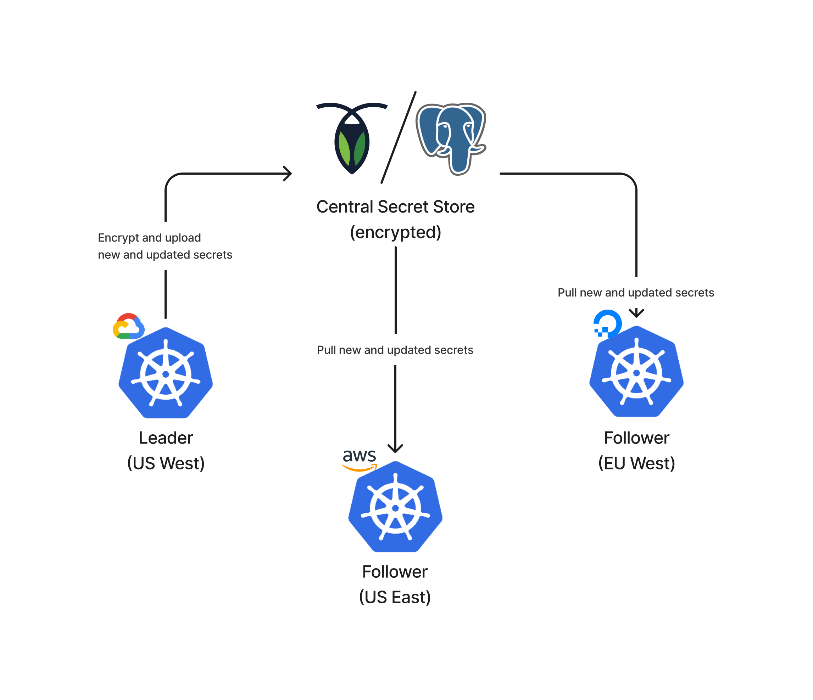

# KubeSecretSync

#### Syncing kubernetes secrets across clusters scalably and securely.

Secrets are encrypted before they ever leave the cluster. Even if someone had access to your database, they wouldn't have access to your secrets. See [Security](#security) for more.
#### Multi-Cloud & Multi-Region

Sync secrets between kubernetes in any region, from any provider.

Unlock true multi-cluster services without complex networking and global load balancers. See [Lets Encrypt Cert Sharing](#lets-encrypt-cert-sharing) for more.

### Database and SQL

CockroachDB and Postgres are the supported databases. The database used should be accessibly by all KubeSecretSync pods in all clusters.

CockroachDB is the preferred database for KubeSecretSync, however in order to offer compatibility CRDB specific features have been omitted to maintain Postgres compatibility.

## Choosing Secrets to Sync

All secrets to sync must have the label `kube-secret-sync=true`.

## Configuration

Env vars are used to configure.

### `DSN`

This is the DSN of the database, either CockroachDB or Postgres.

### `ENCRYPTION_KEY`

The key used for encryption and decryption of secrets to and from the DB. Must be the same for leaders and followers, and must be 32 characters in length.

### `LEADER`

If set to `1`, then this indicates that the node is the leader and should act as a writer to the DB.

If not set to `1` then it will follow the state of the DB, adding annotations to the secrets based on the last update time from the DB.

### `TICK_SECONDS`

The timeout and interval for the loop. Default `20`. Ensure to raise this if you have lots of secrets, as you want lots of time to ensure secrets are synced before restarting the loop.

### `DEBUG`

If set to `1`, will print debug logs.

### `PRETTY`

If set to `1`, will format with standard logrus format.

## Lets Encrypt Cert Sharing

You can use KubeSecretSync to share Cert-Manager certificates with multiple clusters.

If you want to make your service highly available and support multiple regions, but you manage your own certificates, this can be very difficult.

Or if you offer a white label service like website hosting that allows customers to setup their own domains, and you serve content based on what domain a request comes from.

Typically you might have to use something like Cloudflare SSL for SaaS, however at $2/month per certificate this can become prohibitively expensive, as well as locking you in to Cloudflare, with their uptime being your uptime.

Let's Encrypt offers free certificates, and allows you to manage them yourself with Cert-Manager.

Multi-Region has been shut off due to the HTTP challenge needing to hit the same host every time.

With KubeSecretSync you can configure a Kubernetes Service and Endpoint on your Follower clusters to forward all `/.well-known/acme` prefixed routes to the Leader. This allows the Leader to manage all certificate provisioning, and syncing the certificate with the Follower clusters.

You can now modify the Ingress resource on all clusters to include the new domain and certificate.

Simply connected these clusters by having your DNS record point to all cluster load balancers, and now you have Multi-Region global load balancing with shared certificates, self-managed, free from vendor lock-in.

You are no longer dependent on a cloud provider, region, or proxy like Cloudflare being up for you to maintain your uptime.

### Labeling Cert Secrets

Following https://cert-manager.io/docs/usage/certificate/#creating-certificate-resources we can use the `spec.secretTemplate.labels` to add `kube-secret-sync=true` so that the secret will have the correct label when created.

### Security

All secrets are encrypted with AES GCM mode before they ever leave the cluster, and are only decrypted once they are pulled down into the cluster from the DB.

[Relevant Code](https://github.com/danthegoodman1/KubeSecretSync/blob/main/secrets.go#L92-L107)
